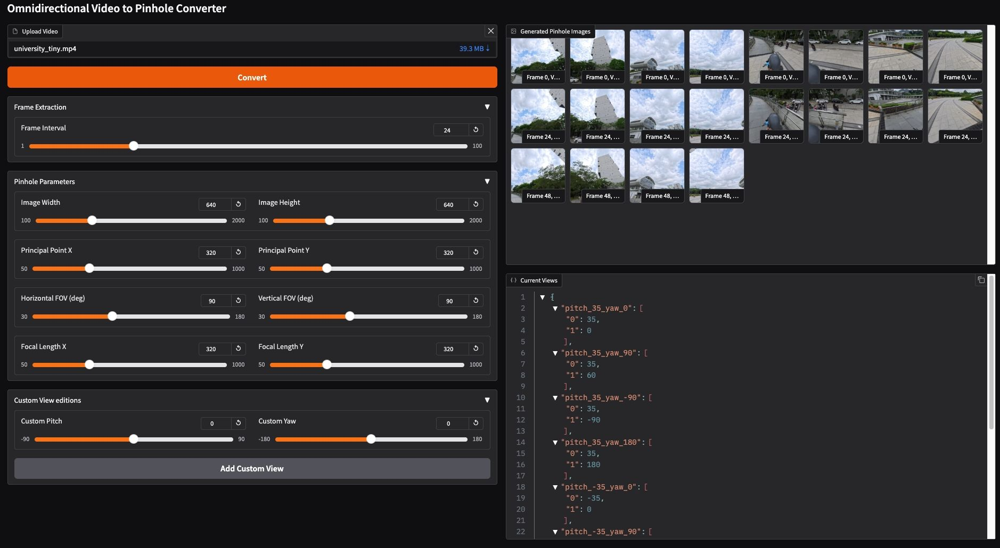

# Omni-SFM  

> Structure-from-Motion pipeline for omnidirectional imagery

## Table of Contents
- [Features](#features)
- [Installation](#installation)
- [Usage](#usage)
- [Configuration](#configuration)
- [Development](#development)
- [License](#license)

## Overview
Omni-SFM is a Structure-from-Motion (SfM) pipeline implementation for omnidirectional imagery. The project provides tools for processing panoramic images and reconstructing 3D scenes using both command-line COLMAP and pycolmap implementations.

## Features
- Support for both command-line COLMAP and pycolmap workflows
- Panoramic image processing capabilities
- Rig-based SfM pipeline
- Modular architecture for easy extension

## Installation

### Prerequisites
- Python 3.8+
- COLMAP installed (for command-line version)
- CUDA-enabled GPU recommended

### Quick Start
```bash
# Clone repository
git clone https://github.com/your-repo/omni-sfm.git
cd omni-sfm

# Install with pip (recommended)
pip install -r requirements.txt
```

### Additional Setup
1. For command-line COLMAP:
   ```bash
   # Follow COLMAP installation instructions for your platform
   ```

2. For ComfyUI integration:
   ```bash
   pip install comfyui
   ```

## Usage

### Main Application
Run the GUI application:
```bash
python app.py
```

Gradio UI:



Output data structure:

``` bash
outputs/20250602xxxxxx/pinhole_images
├── images
│   ├── pitch_-35_yaw_-90
│   ├── pitch_-35_yaw_0
│   ├── pitch_-35_yaw_180
│   ├── pitch_-35_yaw_90
│   ├── pitch_35_yaw_-90
│   ├── pitch_35_yaw_0
│   ├── pitch_35_yaw_180
│   └── pitch_35_yaw_90
├── camera_params.json
└── rig_config.json
```


### Scripts
The project includes several scripts in the `scripts/` directory:

1. **run_cmd_colmap_rig_sfm.py**
   Runs the SfM pipeline using command-line COLMAP with rig support.

   **Parameters:**
   - `--image_path`: Path to input images directory (required)
   - `--output_path`: Path to output directory (required)
   - `--rig_config`: Path to rig configuration JSON file (required)
   - `--camera_config`: Path to camera parameters JSON file (required)
   - `--camera_model`: Camera model type (default: "PINHOLE", options: ["PINHOLE", "SIMPLE_PINHOLE", "SIMPLE_RADIAL"])
   - `--visualize`: Flag to visualize the sparse reconstruction

   **Usage Example:**
   ```bash
   python scripts/run_cmd_colmap_rig_sfm.py \
       --image_path inputs/images \
       --rig_config configs/rig.json \
       --camera_config configs/camera.json \
       --output_path outputs/sfm \
       --visualize
   # eg.
   python scripts/run_cmd_colmap_rig_sfm.py \
       --image_path outputs/20250602xxxxxx/pinhole_images/images \
       --rig_config outputs/20250602xxxxxx/pinhole_images/rig.json \
       --camera_config outputs/20250602xxxxxx/pinhole_images/camera.json \
       --output_path outputs/20250602xxxxxx/sfm \
       --visualize
   ```

2. **run_pycolmap_rig_sfm.py**
   Runs the SfM pipeline using pycolmap with rig support.

   Usage:
   ```bash
   python scripts/run_pycolmap_rig_sfm.py [options]
   ```

## Configuration

Modify `src/omni_processor.py` for pipeline configuration options.

## ComfyUI Quick Start Guide

The project includes a ComfyUI implementation for panoramic video processing and reconstruction with these features:

- Panoramic video loading (equirectangular and cubemap formats)
- Virtual pinhole camera generation from panoramic frames
- Panoramic-specific reconstruction parameters
- Interactive 360° preview capabilities

### Installation
1. Install ComfyUI (if not already installed):
```bash
git clone https://github.com/comfyanonymous/ComfyUI
cd ComfyUI
pip install -r requirements.txt
```

2. Copy our nodes to ComfyUI's custom_nodes folder:
```bash
mkdir /path/to/ComfyUI/custom_nodes/omni-sfm
cp -r /path/to/omni-sfm/src/* /path/to/ComfyUI/custom_nodes/omni-sfm/
```

3. Install required dependencies:
```bash
pip install -r /path/to/omni-sfm/requirements.txt
```

### Basic Usage
1. Start ComfyUI:
```bash
python main.py
```

2. In the web interface (http://localhost:8188):
   - Right-click to open node menu
   - Search for "Omni" to find our nodes
   - Connect them as shown below:

```
[OmniVideoLoader] → [OmniParameterControls] → [OmniVideoProcessor]
                     ↓
[OmniPreview] ← [OmniReconstruction]
```

UI:


3. Example workflow:
   - Load panoramic video with OmniVideoLoader
   - Set parameters with OmniParameterControls
   - Process video with OmniVideoProcessor
   - View results with OmniPreview
   - Run reconstruction with OmniReconstruction


### Contributing
1. Fork the repository
2. Create a feature branch
3. Submit a pull request

## License
[MIT License](LICENSE)
